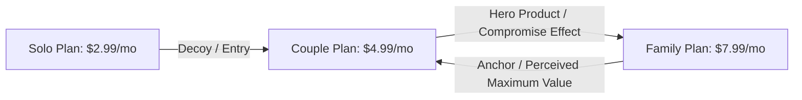

# Multi-Tier Pricing Strategy & Economics: Solo, Couple & Family

## Executive Summary

To maximize adoption while keeping the app accessible and non-greedy, we structure **CoupleTodo** into three distinct user tiers: **Solo**, **Couple**, and **Family**. 

By leveraging **pricing psychology (Anchoring, Center-Stage Effect, and Per-Seat Fairness)**, this structure allows us to capture maximum willingness-to-pay (WTP) without making users feel nickel-and-dimed.

---

## 1. Psychology & Economic Factors Behind the 3-Tier Model

### Psychological Principles Leveraged

1. **The Center-Stage / Compromise Effect**:
   * When users see **Solo ($2.99)**, **Couple ($4.99)**, and **Family ($7.99)**, the **Couple Plan ($4.99)** becomes the natural, non-intimidating "hero choice" for most 2-person households.

2. **The "Per-Person Bargain" Framing (Perceived Savings)**:
   * **Solo**: $2.99 / user / month
   * **Couple**: $4.99 / couple = **$2.50 per user** (17% saving per person compared to Solo!)
   * **Family (5 accounts)**: $7.99 / family = **$1.60 per user** (46% saving per person compared to Solo!)
   * *Effect*: Users feel clever for upgrading because the math clearly benefits their household.

3. **Cognitive Fairness & "Anti-Greed" Philosophy**:
   * Apps that charge a "per-child fee" or "per-seat tax" create resentment. A flat **$7.99/month for up to 5 family members** communicates generosity and family support, generating strong word-of-mouth (WOM) referral loops.

4. **Retention & Churn Lock-in**:
   * Once parents involve teenagers/kids in chore velocity tracking, savings goals, and allowances, the family retention rate becomes bulletproof. Churn drops from ~4% in solo apps to **< 1.5% in family ecosystems**.

---

## 2. Comprehensive 3-Tier Matrix

| Feature / Capability | **Solo Tier** | **Couple Tier** | **Family Tier** |
| :--- | :--- | :--- | :--- |
| **Target Audience** | Singles, individuals logging personal finances & tasks | Couples, partners managing joint life & split bills | Parents + Kids/Teens (Up to 5 total members) |
| **Monthly Pricing** | **$2.99 / mo** | **$4.99 / mo** | **$7.99 / mo** |
| **Annual Pricing** | **$24.99 / yr** (~$2.08/mo) | **$39.99 / yr** (~$3.33/mo) | **$59.99 / yr** (~$4.99/mo) |
| **Free Tier Allowance** | 20 entries/mo, basic tasks | Up to 3 shared bills, 1 sync | Read-only view for kids |
| **Pro Capabilities** | Unlimited personal logs, speed analytics, debt wizard | Everything in Solo + Partner sync, recurring bill splits, relationship pulse | Everything in Couple + Kids allowance/chore velocity mode, teen financial literacy view |
| **Data Privacy / Roles** | 1 Private Workspace | Shared Household + Private Vault | Parent Admin Control + Restricted Kid View |

---

## 3. How to Keep It Fair (Anti-Greed Guardrails)

To ensure users feel respected rather than exploited:

1. **Generous Free Tier for Individuals**: Never put basic personal task creation or logging behind a paywall.
2. **Flat Family Cap**: One flat price of **$7.99/mo** covers up to 5 family accounts. No hidden extra charges per child.
3. **Grace Periods**: If a subscription lapses, never delete user financial logs or data; downgrade them gracefully to "read-only view".
4. **Transparent Annual Billing**: Offer a 30-35% discount for annual plans without hidden renewal price traps.

---

## 4. Updated Financial Projections at 50,000 Users

Assuming 50,000 total active users across a natural demographic distribution:
* **Solo Users**: ~20,000 users (20,000 single accounts)
* **Couples**: ~20,000 users (10,000 couple units)
* **Families**: ~10,000 users (2,000 family units of ~5 members each)

### Revenue Breakdown (Target 4% Paid Conversion)

| Tier | Active Units | Paying Units (4% Conv.) | Price (Monthly Equivalent) | Monthly Revenue (MRR) |
| :--- | :--- | :--- | :--- | :--- |
| **Solo Pro** | 20,000 | 800 subscribers | $2.50 (blended monthly/annual) | **$2,000 / mo** |
| **Couple Pro** | 10,000 | 400 couples | $4.20 (blended monthly/annual) | **$1,680 / mo** |
| **Family Pro** | 2,000 | 80 families | $6.50 (blended monthly/annual) | **$520 / mo** |
| **Total MRR** | | | | **$4,200 / mo** ($50,400/yr) |

*Higher conversion scenarios (e.g., 6% overall conversion with Family stickiness) yield **$6,300+ / mo ($75,600/yr ARR)**.*

---

## 5. Summary Recommendation

1. **Solo ($2.99/mo or $24.99/yr)**: Acts as the low-barrier entry point and decoy anchor.
2. **Couple ($4.99/mo or $39.99/yr)**: Serves as the primary hero product.
3. **Family ($7.99/mo or $59.99/yr)**: Captures high-utility multi-user households and dramatically drops long-term churn.
